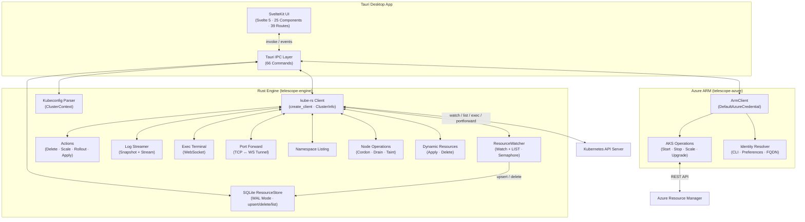
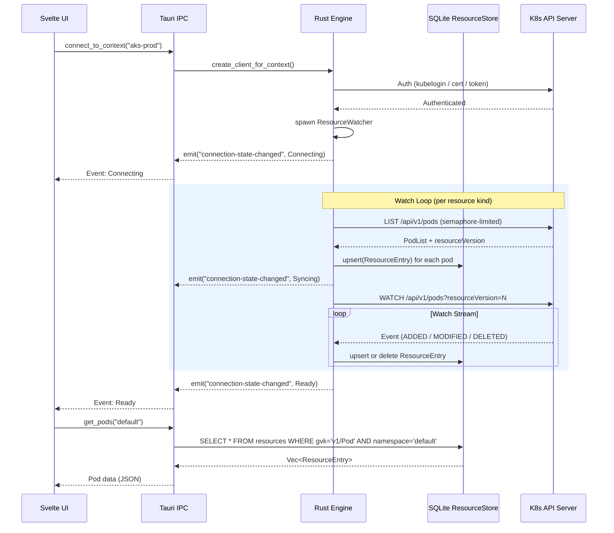
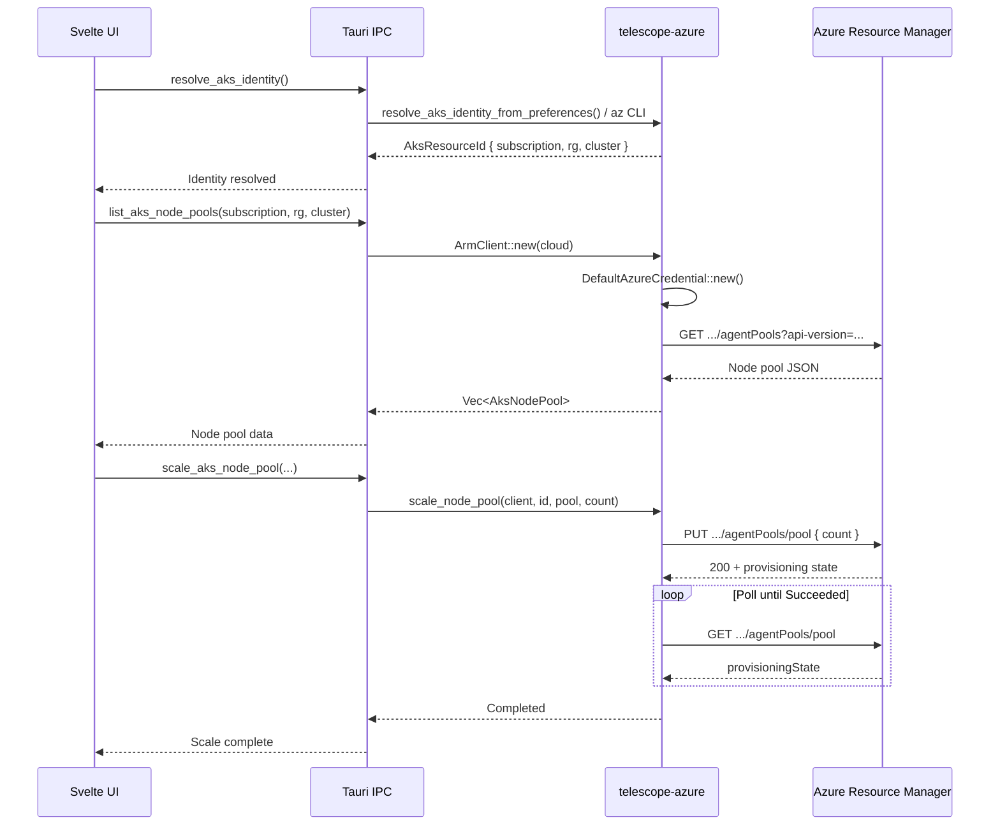
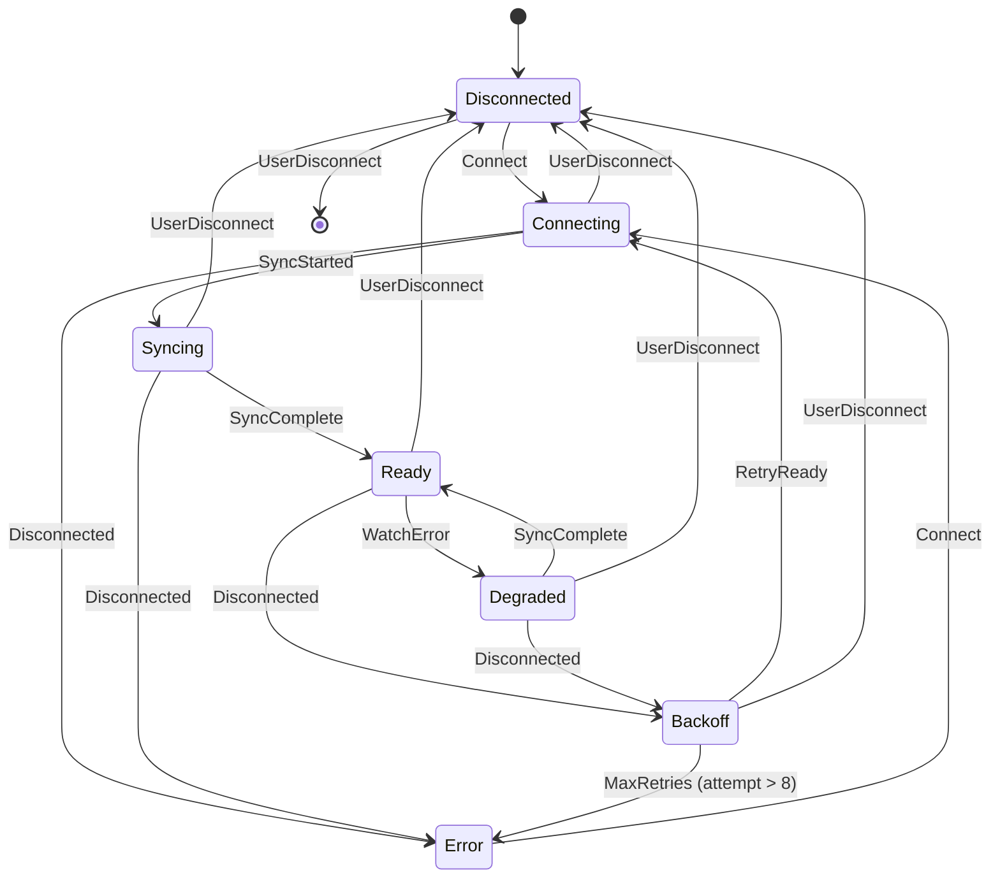
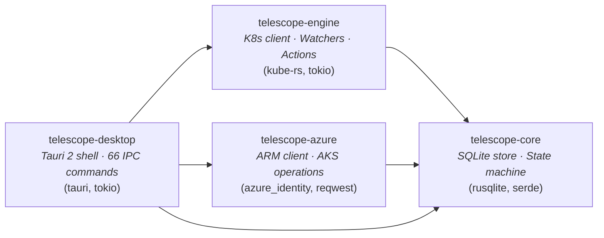

# Telescope — Architecture

This document describes the implemented architecture of the current Telescope v1.x desktop release line.

## Goals

- Avoid Electron; keep resident memory low.
- Desktop-only Tauri application — no hub/web server mode.
- One shared Kubernetes engine powering the desktop UI.
- Watch-driven, on-demand data flow; no "watch the whole cluster" by default.
- Secure handling of kubeconfig/tokens/secrets.
- Native Azure ARM integration for AKS cluster management.

---

## High-Level Architecture



### Components

**Engine (`crates/engine`)** — The Kubernetes backend, built on [kube-rs](https://kube.rs):

| Module | Responsibility |
|--------|---------------|
| `client.rs` | Client construction, `ClusterInfo` extraction (server version, auth type, AKS detection) |
| `watcher.rs` | `ResourceWatcher` — LIST+WATCH loop with exponential backoff, semaphore-limited concurrency (max 3 LISTs), converts K8s objects to `ResourceEntry` |
| `actions.rs` | Imperative operations: delete, scale (Deployment/StatefulSet), rollout restart/status, server-side apply |
| `logs.rs` | Pod log snapshot and async streaming via `LogRequest` / `LogChunk` |
| `exec.rs` | Non-interactive `kubectl exec` over WebSocket |
| `portforward.rs` | TCP ↔ K8s WebSocket tunnel for port forwarding |
| `namespace.rs` | `list_namespaces()`, `create_namespace()`, `delete_namespace()` |
| `kubeconfig.rs` | Parse `~/.kube/config`, list contexts with auth metadata |
| `node_ops.rs` | Cordon, uncordon, drain, add/remove taints |
| `dynamic.rs` | Generic dynamic resource apply/delete for arbitrary GVKs |
| `helm.rs` | Helm release listing, history, values (with sensitive key redaction), rollback |
| `metrics.rs` | Pod and node metrics via the Metrics API |
| `crd.rs` | CRD discovery and instance listing |
| `secrets.rs` | On-demand secret fetch with payload redaction |
| `audit.rs` | JSONL audit log for destructive and sensitive operations |

**Core (`crates/core`)** — Shared domain types with zero K8s dependencies:

| Module | Responsibility |
|--------|---------------|
| `store.rs` | `ResourceStore` — SQLite document store. `ResourceEntry` rows keyed by (gvk, namespace, name) with full JSON content. Methods: `upsert`, `delete`, `list`, `get`, `count`. Also stores user preferences. |
| `connection.rs` | `ConnectionState` / `ConnectionEvent` — 7-state finite state machine with exponential backoff (1 s base, 256 s cap) |

**Azure (`crates/azure`)** — Azure ARM integration for AKS cluster management:

| Module | Responsibility |
|--------|---------------|
| `client.rs` | `ArmClient` — Azure ARM REST client using `DefaultAzureCredential`. Handles token acquisition, cloud-specific endpoints, and error mapping (404/409/API errors). |
| `types.rs` | `AzureCloud` enum (Commercial, UsGovernment, UsGovSecret, UsGovTopSecret) with endpoint resolution. `AksResourceId` for ARM path construction. |
| `aks.rs` | AKS control-plane operations: `get_cluster`, `start_cluster`, `stop_cluster`, `get_upgrade_profile`, `upgrade_cluster`, `list_node_pools`, `scale_node_pool`, `update_autoscaler`, `create_node_pool`, `delete_node_pool`, `upgrade_pool_version`, `upgrade_pool_node_image`, `list_maintenance_configs`. Long-running operations poll ARM (15 s interval, 80 max polls). |
| `resolve.rs` | AKS identity resolution: saved preferences → Azure CLI (`az aks list`) → FQDN hints. Resolves subscription, resource group, and cluster name. |
| `error.rs` | `AzureError` variants: `NotFound`, `Conflict`, `Api { status, code, message }`, `Identity`, `Http`, `Json`, `CliNotFound`, `CliFailed` |

**Desktop (`apps/desktop`)** — Tauri 2 shell exposing 66 IPC commands across nine groups: context/connection (7), Azure ARM/AKS (18), resource queries (8), secrets (2), Helm (4), namespaces (3), logs (3), resource actions/node ops (15), exec/portforward/metrics (6). State is held in `AppState` (SQLite store + connection state + watch handle).

**Frontend (`apps/web`)** — SvelteKit frontend (Svelte 5 runes). 25 components, 39 routes, Svelte writable/derived stores for context, namespace, and connection state. `api.ts` wraps Tauri command invocations for the desktop shell.

---

## Data Flow



### Azure ARM Data Flow



### Key Design Decisions

- **SQLite as cache** — All K8s objects are stored as JSON blobs in a single `resources` table. The UI reads from SQLite, never directly from the API server. This decouples watch latency from UI responsiveness.
- **Scoped watchers** — Watchers are started per-namespace when a user connects. Switching namespaces (`set_namespace`) aborts existing watches and spawns new ones.
- **Semaphore-limited LIST** — At most 3 concurrent LIST operations to avoid overwhelming the API server during initial sync.
- **Event-driven UI** — Connection state changes are pushed to the frontend via Tauri events, not polled.
- **Azure ARM is separate** — AKS management operations use the Azure ARM REST API through `crates/azure`, not the Kubernetes API. This keeps the K8s engine decoupled from Azure-specific logic.

---

## Connection State Machine



**States** (from `ConnectionState` enum in `crates/core/src/connection.rs`):

| State | Description |
|-------|-------------|
| `Disconnected` | No connection attempted |
| `Connecting` | Attempting initial connection and authentication |
| `Syncing { resources_synced, resources_total }` | Performing initial LIST; progress is tracked |
| `Ready` | Fully connected with active WATCH streams |
| `Degraded { message }` | Connected but experiencing partial failures |
| `Error { message }` | Connection lost or authentication failed |
| `Backoff { attempt, wait }` | Exponential backoff before retry (1 s base, 256 s cap) |

**Events**: `Connect`, `Authenticated`, `SyncStarted`, `SyncProgress`, `SyncComplete`, `WatchError`, `Disconnected`, `RetryReady`, `UserDisconnect`

---

## Crate Dependency Graph



Workspace layout:

```
crates/core      → telescope-core     (no internal deps)
crates/engine    → telescope-engine   (depends on core)
crates/azure     → telescope-azure    (depends on core)
apps/desktop     → telescope-desktop  (depends on engine + azure + core; excluded from default-members for Linux CI)
```

---

## Storage

**SQLite ResourceStore** (`crates/core/src/store.rs`) — WAL-mode SQLite database at `~/.telescope/resources.db`.

### Pragmas

```sql
PRAGMA journal_mode = WAL;
PRAGMA synchronous = NORMAL;
PRAGMA foreign_keys = ON;
```

### Schema

```sql
CREATE TABLE IF NOT EXISTS resources (
    gvk              TEXT NOT NULL,
    namespace        TEXT NOT NULL DEFAULT '',
    name             TEXT NOT NULL,
    resource_version TEXT NOT NULL DEFAULT '',
    content          TEXT NOT NULL,        -- full JSON representation
    updated_at       TEXT NOT NULL DEFAULT (strftime('%Y-%m-%dT%H:%M:%fZ', 'now')),
    PRIMARY KEY (gvk, namespace, name)
);

CREATE INDEX IF NOT EXISTS idx_resources_gvk_ns
    ON resources (gvk, namespace);
```

### Tracked resource types

| GVK | Capabilities |
|-----|-------------|
| `v1/Pod` | Watch, list, logs, exec, port-forward, delete, apply, metrics |
| `v1/Node` | Watch, list, AKS node-pool grouping, cordon/uncordon, drain, taint, metrics |
| `v1/Event` | Watch, list, filter by involved object |
| `v1/Namespace` | List, create, delete |
| `v1/Service` | List, delete, apply |
| `v1/ConfigMap` | List, delete, apply |
| `v1/Secret` | On-demand fetch (not cached), delete, apply, redacted by default |
| `v1/ServiceAccount` | List, delete, apply |
| `v1/PersistentVolume` | List |
| `v1/ResourceQuota` | List |
| `v1/LimitRange` | List |
| `v1/EndpointSlice` | List |
| `apps/v1/Deployment` | List, scale, rollout restart/status, delete, apply |
| `apps/v1/StatefulSet` | List, scale, delete, apply |
| `apps/v1/DaemonSet` | List, delete, apply |
| `batch/v1/Job` | List, delete, apply |
| `batch/v1/CronJob` | List, delete, apply |
| `networking.k8s.io/v1/Ingress` | List, delete, apply |
| `networking.k8s.io/v1/NetworkPolicy` | List, delete, apply |
| `autoscaling/v2/HPA` | List |
| `policy/v1/PodDisruptionBudget` | List |
| `scheduling.k8s.io/v1/PriorityClass` | List |
| `storage.k8s.io/v1/StorageClass` | List |
| `rbac.authorization.k8s.io/v1/Role` | List |
| `rbac.authorization.k8s.io/v1/RoleBinding` | List |
| `admissionregistration.k8s.io/v1/Webhooks` | List |

---

## Security Model

### Implemented

- ✅ **Kubeconfig references** — reads `~/.kube/config` directly via kube-rs; does not copy or embed credentials.
- ✅ **Auth type detection** — identifies exec plugin, token, or certificate auth per context (`kubeconfig.rs`).
- ✅ **Exec plugin support** — delegates to kubelogin / az CLI for Azure Entra ID auth.
- ✅ **AKS auth hints** — surfaces human-readable auth description (e.g., "Authenticated via Azure Entra ID (kubelogin)") in `ClusterInfo`.
- ✅ **Production guardrails** — name-pattern detection (`/prod/i`, `/production/i`, `/\bprd\b/i`, `/\blive\b/i` in `prod-detection.ts`). Production contexts force type-to-confirm on destructive operations via `ConfirmDialog`.
- ✅ **Server-side dry-run** — `apply_resource` supports `dry_run: bool` for safe preview before mutation.
- ✅ **Database isolation** — SQLite store at `~/.telescope/resources.db` (per-user home directory).
- ✅ **Secrets redacted by default** — secret payload fields (`data`, `stringData`, `binaryData`, `last-applied-configuration`) are replaced with `●●●●●●●●` before serialization.
- ✅ **Helm values redacted** — sensitive keys (`password`, `token`, `secret`, `apiKey`, `connectionString`, `private_key`, `client_secret`, `access_key`, `credentials`, `auth`, and variants) are recursively redacted in Helm release values.
- ✅ **Audit logging** — JSONL audit entries for destructive operations (see Audit section below).
- ✅ **File permissions** — audit log and SQLite DB created with `0600` permissions on Unix.
- ✅ **Azure ARM auth** — `DefaultAzureCredential` for ARM API access; no hardcoded secrets (see Azure ARM Security section below).

### Azure ARM Security

- **Authentication**: `ArmClient` uses `azure_identity::DefaultAzureCredential`, which chains: environment variables → managed identity → Azure CLI → workload identity → Visual Studio Code credential. No credentials are stored by Telescope.
- **Token scope**: Tokens are scoped to the ARM management endpoint for the target cloud (e.g., `https://management.azure.com/.default` for Commercial, `https://management.usgovcloudapi.net/.default` for Government).
- **Azure Government support**: `AzureCloud` enum supports Commercial, UsGovernment, UsGovSecret, and UsGovTopSecret clouds with correct ARM/auth/portal endpoints per cloud.
- **RBAC requirements**: ARM operations require the operator's Azure identity to hold appropriate RBAC roles on the AKS resource. `Reader` on the AKS resource is sufficient for read-only views (cluster details, node pools, upgrade profiles, maintenance configs). `Azure Kubernetes Service Contributor` is the recommended minimum for management operations (start/stop cluster, scale/create/delete node pools, upgrade cluster/pool versions, update autoscaler config).
- **ARM operations are audited**: all AKS management operations (node pool scale, create, delete, autoscaler update) are logged to the local audit log (`~/.telescope/audit.log`).

### Not yet implemented

- 🔲 OS keychain envelope encryption for stored tokens
- 🔲 RBAC capability pre-checks before every mutation
- 🔲 Diff preview for all apply operations

---

## AKS-Specific

- ✅ **Auth type detection** — `is_aks_url()` identifies AKS clusters (`*.azmk8s.io`); `exec` auth delegates to kubelogin / az CLI for Azure Entra ID flows.
- ✅ **Node pool visibility** — label parsing (`agentpool`, `kubernetes.azure.com/agentpool`) with grouping by pool. Extracts VM size (`node.kubernetes.io/instance-type`), OS type (`kubernetes.azure.com/os-type`), and mode (`kubernetes.azure.com/mode`: System/User). Component: `NodePoolHeader`.
- ✅ **Add-on status** — pod pattern detection for Container Insights (`ama-logs`, `omsagent`), Azure Policy, Key Vault CSI, KEDA, Flux GitOps, Ingress NGINX. Status derived from pod phase.
- ✅ **Portal deep links** — constructs Azure Portal URLs by parsing server URL (`*.hcp.*.azmk8s.io`) to extract subscription, resource group, and cluster name.
- ✅ **Workload Identity visibility** — detects `azure.workload.identity/use` pod label and `azure.workload.identity/client-id` service account annotation. Component: `AzureIdentitySection`.
- ✅ **Azure ARM cluster management** — `crates/azure` provides full AKS lifecycle via ARM REST API:
  - Cluster: start, stop, get detail, upgrade, maintenance configs
  - Node pools: list, create, delete, scale, update autoscaler, upgrade version, upgrade node image
  - Identity: auto-resolve subscription/resource-group/cluster from Azure CLI or saved preferences
  - Long-running operations: built-in ARM polling (15 s interval, 80 max polls)

---

## Tauri Command Registry

66 commands registered via `tauri::generate_handler![]` in `apps/desktop/src-tauri/src/main.rs`.

### Connection & context

| Command | Description |
|---------|-------------|
| `list_contexts` | List kubeconfig contexts |
| `active_context` | Current active context |
| `connect_to_context` | Connect to a cluster |
| `disconnect` | Disconnect from cluster |
| `set_namespace` | Change watched namespace |
| `get_namespace` | Get current namespace |
| `get_connection_state` | Connection status |

### Azure ARM / AKS

| Command | Description |
|---------|-------------|
| `get_cluster_info` | Cluster version, auth, AKS info |
| `resolve_aks_identity` | Resolve AKS subscription/RG/cluster |
| `get_aks_cluster_detail` | Full AKS cluster detail from ARM |
| `list_aks_node_pools` | List node pools from ARM |
| `start_aks_cluster` | Start a stopped AKS cluster |
| `stop_aks_cluster` | Stop a running AKS cluster |
| `get_aks_upgrade_profile` | Available cluster upgrades |
| `upgrade_aks_cluster` | Upgrade cluster Kubernetes version |
| `get_pool_upgrade_profile` | Available pool upgrades |
| `upgrade_pool_version` | Upgrade pool Kubernetes version |
| `upgrade_pool_node_image` | Upgrade pool node OS image |
| `scale_aks_node_pool` | Scale pool node count |
| `update_aks_autoscaler` | Configure pool autoscaler |
| `create_aks_node_pool` | Create a new node pool |
| `delete_aks_node_pool` | Delete a node pool |
| `list_aks_maintenance_configs` | List maintenance windows |
| `get_azure_cloud` | Get current Azure cloud setting |
| `set_azure_cloud` | Set Azure cloud (Commercial/Gov/Secret/TopSecret) |

### Resource queries

| Command | Description |
|---------|-------------|
| `get_pods` | List pods |
| `get_resources` | List resources by GVK |
| `get_events` | List/filter events |
| `get_resource_counts` | Resource counts by GVK |
| `count_resources` | Count resources |
| `search_resources` | Search resources by name |
| `list_dynamic_resources` | List resources for a dynamic GVK |
| `get_dynamic_resource` | Get a single dynamic resource |
| `get_resource` | Get single resource |
| `get_secrets` | List secrets (on-demand, not cached) |
| `get_secret` | Get single secret (redacted) |

### Helm

| Command | Description |
|---------|-------------|
| `list_helm_releases` | List releases across namespaces |
| `get_helm_release_history` | Release revision history |
| `get_helm_release_values` | Release values (redacted unless revealed) |
| `helm_rollback` | Rollback to a previous revision |

### Namespaces

| Command | Description |
|---------|-------------|
| `list_namespaces` | List all namespaces |
| `create_namespace` | Create a namespace |
| `delete_namespace` | Delete a namespace |

### Log streaming

| Command | Description |
|---------|-------------|
| `get_pod_logs` | Snapshot log fetch |
| `list_containers` | List pod containers |
| `start_log_stream` | Follow logs; emits `log-chunk` events |

### Resource actions & node operations

| Command | Description |
|---------|-------------|
| `apply_dynamic_resource` | Apply a dynamic resource |
| `delete_dynamic_resource` | Delete a dynamic resource |
| `scale_resource` | Scale deployment/statefulset |
| `delete_resource` | Delete a resource |
| `apply_resource` | Server-side apply (with dry-run option) |
| `rollout_restart` | Rollout restart |
| `rollout_status` | Rollout status |
| `cordon_node` | Mark node unschedulable |
| `uncordon_node` | Mark node schedulable |
| `drain_node` | Drain workloads from node |
| `add_node_taint` | Add taint to node |
| `remove_node_taint` | Remove taint from node |

### Exec, port-forward & metrics

| Command | Description |
|---------|-------------|
| `exec_command` | Non-interactive exec |
| `start_port_forward` | Port-forward; returns bound port |
| `get_pod_metrics` | Pod CPU/memory metrics |
| `check_metrics_available` | Check if Metrics API is available |
| `get_node_metrics` | Node CPU/memory metrics |
| `list_crds` | List CRD definitions |

### Preferences

| Command | Description |
|---------|-------------|
| `get_preference` | Read a stored preference |
| `set_preference` | Write a stored preference |

---

## Audit Logging

`crates/engine/src/audit.rs` writes structured JSONL entries to `~/.telescope/audit.log` (permissions `0600` on Unix).

Each `AuditEntry` contains: `timestamp`, `actor`, `context`, `namespace`, `action`, `resource_type`, `resource_name`, `result`, `detail`.

### Audited operations

| Category | Operations |
|----------|-----------|
| Connection | `connect_to_context`, `disconnect` |
| AKS node pools | `scale_aks_node_pool`, `update_aks_autoscaler`, `create_aks_node_pool`, `delete_aks_node_pool` |
| Helm | `helm_rollback` |
| Namespaces | `create_namespace`, `delete_namespace` |
| Resources | `apply_dynamic_resource`, `delete_dynamic_resource`, `scale_resource`, `delete_resource`, `apply_resource`, `rollout_restart` |
| Node ops | `cordon_node`, `uncordon_node`, `drain_node`, `add_node_taint`, `remove_node_taint` |
| Exec | `exec_command` |

---

## Future (Not Yet Implemented)

> ⚠️ The following sections describe **target architecture** that is not yet built.

- **WASM Plugin System** — Capability-based plugins (wasmtime) with permissions manifest and strict host API.
- **LRU/TTL Eviction** — Hard caps on caches (Events/Pods/log lines) with burst coalescing and backpressure.
