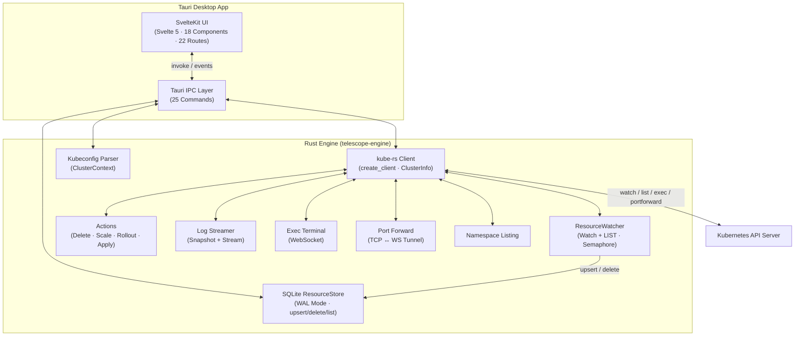
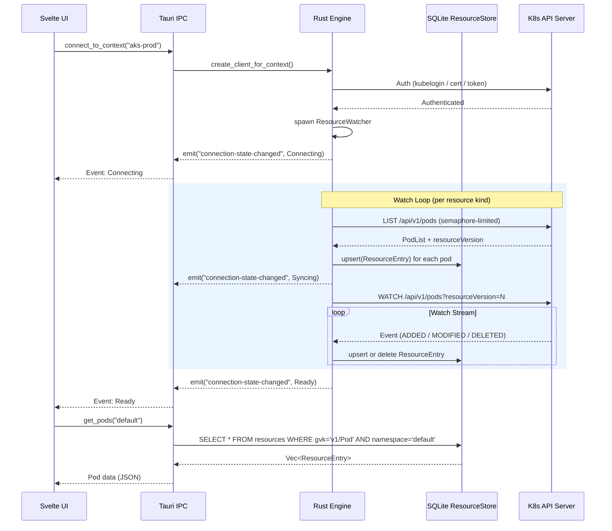
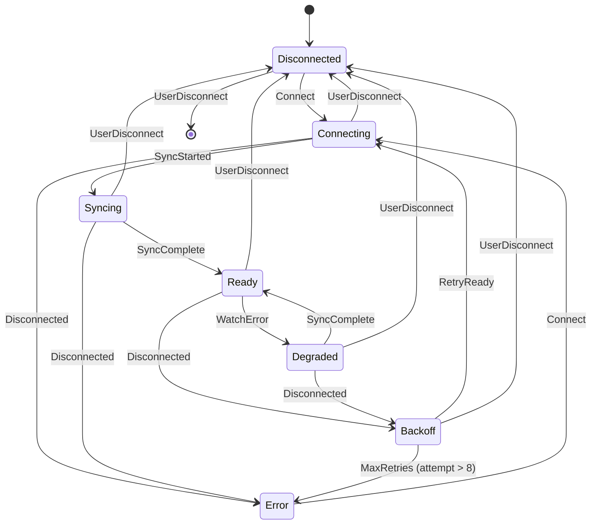
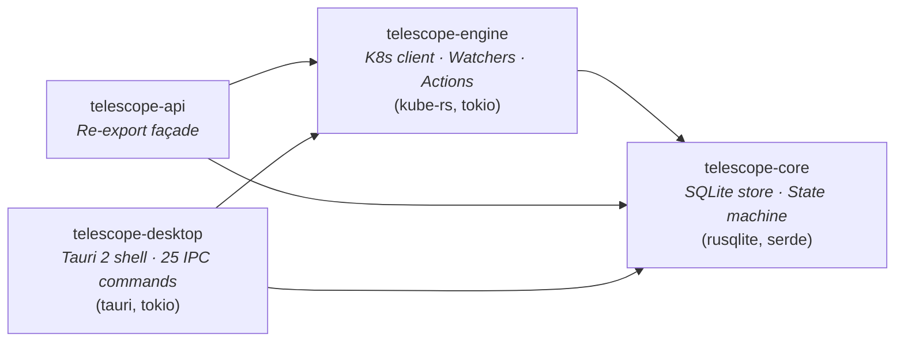

# Telescope — Architecture

This document describes the implemented architecture of Telescope v0.5.0.

## Goals

- Avoid Electron; keep resident memory low.
- One shared Kubernetes engine powering the desktop application.
- Watch-driven, on-demand data flow; no "watch the whole cluster" by default.
- Secure handling of kubeconfig/tokens/secrets.

---

## High-Level Architecture



### Components

**Engine (`crates/engine`)** — The Kubernetes backend, built on [kube-rs](https://kube.rs):

| Module | Responsibility |
|--------|---------------|
| `client.rs` | Client construction, `ClusterInfo` extraction (server version, auth type, AKS detection) |
| `watcher.rs` | `ResourceWatcher` — LIST+WATCH loop with exponential backoff, semaphore-limited concurrency (max 3 LISTs), converts K8s objects to `ResourceEntry` |
| `actions.rs` | Imperative operations: delete (9 resource kinds), scale (Deployment/StatefulSet), rollout restart/status, server-side apply |
| `logs.rs` | Pod log snapshot and async streaming via `LogRequest` / `LogChunk` |
| `exec.rs` | Non-interactive `kubectl exec` over WebSocket |
| `portforward.rs` | TCP ↔ K8s WebSocket tunnel for port forwarding |
| `namespace.rs` | `list_namespaces()` |
| `kubeconfig.rs` | Parse `~/.kube/config`, list contexts with auth metadata |

**Core (`crates/core`)** — Shared domain types with zero K8s dependencies:

| Module | Responsibility |
|--------|---------------|
| `store.rs` | `ResourceStore` — SQLite document store. `ResourceEntry` rows keyed by (gvk, namespace, name) with full JSON content. Methods: `upsert`, `delete`, `list`, `get`, `count` |
| `connection.rs` | `ConnectionState` / `ConnectionEvent` — 7-state finite state machine with exponential backoff (1 s base, 256 s cap) |

**Desktop (`apps/desktop`)** — Tauri 2 shell exposing 25 IPC commands across six groups: context/connection (6), namespace (4), resource queries (6), logs (3), actions (5), exec/portforward (2). State is held in `AppState` (SQLite store + connection state + watch handle).

**Frontend (`apps/web`)** — SvelteKit 2 frontend (Svelte 5 runes). 18 components, 22 routes, Svelte writable/derived stores for context, namespace, and connection state. `api.ts` wraps Tauri command invocations for the desktop shell.

**API (`crates/api`)** — Thin re-export façade over engine + core.

---

## Data Flow



### Key Design Decisions

- **SQLite as cache** — All K8s objects are stored as JSON blobs in a single `resources` table. The UI reads from SQLite, never directly from the API server. This decouples watch latency from UI responsiveness.
- **Scoped watchers** — Watchers are started per-namespace when a user connects. Switching namespaces (`set_namespace`) aborts existing watches and spawns new ones.
- **Semaphore-limited LIST** — At most 3 concurrent LIST operations to avoid overwhelming the API server during initial sync.
- **Event-driven UI** — Connection state changes are pushed to the frontend via Tauri events, not polled.

---

## Connection State Machine



**States** (from `ConnectionState` enum in `crates/core/src/connection.rs`):

| State | Description |
|-------|-------------|
| `Disconnected` | No connection attempted |
| `Connecting` | Attempting initial connection and authentication |
| `Syncing { resources_synced, resources_total }` | Performing initial LIST; progress is tracked |
| `Ready` | Fully connected with active WATCH streams |
| `Degraded { message }` | Connected but experiencing partial failures |
| `Error { message }` | Connection lost or authentication failed |
| `Backoff { attempt, wait }` | Exponential backoff before retry (1 s base, 256 s cap) |

**Events**: `Connect`, `Authenticated`, `SyncStarted`, `SyncProgress`, `SyncComplete`, `WatchError`, `Disconnected`, `RetryReady`, `UserDisconnect`

---

## Crate Dependency Graph



Workspace layout:

```
crates/core      → telescope-core     (no internal deps)
crates/engine    → telescope-engine   (depends on core)
crates/api       → telescope-api      (depends on engine + core)
apps/desktop     → telescope-desktop  (depends on engine + core; excluded from default-members for Linux CI)
```

---

## Storage

**SQLite ResourceStore** (`crates/core/src/store.rs`) — WAL-mode SQLite database at `~/.telescope/resources.db`.

### Pragmas

```sql
PRAGMA journal_mode = WAL;
PRAGMA synchronous = NORMAL;
PRAGMA foreign_keys = ON;
```

### Schema

```sql
CREATE TABLE IF NOT EXISTS resources (
    gvk              TEXT NOT NULL,
    namespace        TEXT NOT NULL DEFAULT '',
    name             TEXT NOT NULL,
    resource_version TEXT NOT NULL DEFAULT '',
    content          TEXT NOT NULL,        -- full JSON representation
    updated_at       TEXT NOT NULL DEFAULT (strftime('%Y-%m-%dT%H:%M:%fZ', 'now')),
    PRIMARY KEY (gvk, namespace, name)
);

CREATE INDEX IF NOT EXISTS idx_resources_gvk_ns
    ON resources (gvk, namespace);
```

### Tracked resource types

| GVK | Capabilities |
|-----|-------------|
| `v1/Pod` | Watch, list, logs, exec, port-forward, delete, apply |
| `v1/Node` | Watch, list, AKS node-pool grouping |
| `v1/Event` | Watch, list, filter by involved object |
| `v1/Namespace` | List |
| `v1/Service` | List, delete, apply |
| `v1/ConfigMap` | List, delete, apply |
| `v1/Secret` | List, delete, apply |
| `apps/v1/Deployment` | List, scale, rollout restart/status, delete, apply |
| `apps/v1/StatefulSet` | List, scale, delete, apply |
| `apps/v1/DaemonSet` | List, delete, apply |
| `batch/v1/Job` | List, delete, apply |
| `batch/v1/CronJob` | List, delete, apply |

---

## Security Model

### Implemented

- ✅ **Kubeconfig references** — reads `~/.kube/config` directly via kube-rs; does not copy or embed credentials.
- ✅ **Auth type detection** — identifies exec plugin, token, or certificate auth per context (`kubeconfig.rs`).
- ✅ **Exec plugin support** — delegates to kubelogin / az CLI for Azure Entra ID auth.
- ✅ **AKS auth hints** — surfaces human-readable auth description (e.g., "Authenticated via Azure Entra ID (kubelogin)") in `ClusterInfo`.
- ✅ **Production guardrails** — name-pattern detection (`/prod/i`, `/production/i`, `/\bprd\b/i`, `/\blive\b/i` in `prod-detection.ts`). Production contexts force type-to-confirm on destructive operations via `ConfirmDialog`.
- ✅ **Server-side dry-run** — `apply_resource` supports `dry_run: bool` for safe preview before mutation.
- ✅ **Database isolation** — SQLite store at `~/.telescope/resources.db` (per-user home directory).

### Not yet implemented

- 🔲 OS keychain envelope encryption for stored tokens
- 🔲 Secret value masking in UI (values currently visible in raw JSON)
- 🔲 Audit log coverage for every destructive operation

## AKS-Specific

- ✅ **Auth type detection** — `is_aks_url()` identifies AKS clusters (`*.azmk8s.io`); `exec` auth delegates to kubelogin / az CLI for Azure Entra ID flows.
- ✅ **Node pool visibility** — label parsing (`agentpool`, `kubernetes.azure.com/agentpool`) with grouping by pool. Extracts VM size (`node.kubernetes.io/instance-type`), OS type (`kubernetes.azure.com/os-type`), and mode (`kubernetes.azure.com/mode`: System/User). Component: `NodePoolHeader`.
- ✅ **Add-on status** — pod pattern detection for Container Insights (`ama-logs`, `omsagent`), Azure Policy, Key Vault CSI, KEDA, Flux GitOps, Ingress NGINX. Status derived from pod phase. Component: `AksAddons`.
- ✅ **Portal deep links** — constructs Azure Portal URLs by parsing server URL (`*.hcp.*.azmk8s.io`) to extract subscription, resource group, and cluster name. Links to cluster overview page.
- ✅ **Workload Identity visibility** — detects `azure.workload.identity/use` pod label and `azure.workload.identity/client-id` service account annotation. Component: `AzureIdentitySection`.
- 🔲 Azure API integration for nodepool scale/upgrade (planned, not yet implemented).

---

## Tauri Command Registry

25 commands registered via `tauri::generate_handler![]` in `apps/desktop/src-tauri/src/main.rs`.

### Connection & context

| Command | Signature | Description |
|---------|-----------|-------------|
| `list_contexts` | `() → Vec<ClusterContext>` | List kubeconfig contexts |
| `active_context` | `(state) → Option<String>` | Current active context |
| `connect_to_context` | `(app, state, context_name: String) → ()` | Connect to a cluster |
| `disconnect` | `(app, state) → ()` | Disconnect from cluster |
| `set_namespace` | `(app, state, namespace: String) → ()` | Change watched namespace |
| `get_namespace` | `(state) → String` | Get current namespace |
| `get_connection_state` | `(state) → ConnectionState` | Connection status |

### Resource queries

| Command | Signature | Description |
|---------|-----------|-------------|
| `get_cluster_info` | `(state) → ClusterInfo` | Cluster version, auth, AKS info |
| `get_pods` | `(state, namespace?) → Vec<ResourceEntry>` | List pods |
| `get_resources` | `(state, gvk, namespace?) → Vec<ResourceEntry>` | List resources by GVK |
| `get_events` | `(state, namespace?, involved_object?) → Vec<ResourceEntry>` | List/filter events |
| `get_resource_counts` | `(state) → Vec<(String, u64)>` | Resource counts by GVK |
| `count_resources` | `(state, gvk, namespace?) → u64` | Count resources |
| `get_resource` | `(state, gvk, namespace, name) → Option<ResourceEntry>` | Get single resource |
| `list_namespaces` | `(state) → Vec<String>` | List namespaces |

### Log streaming

| Command | Signature | Description |
|---------|-----------|-------------|
| `get_pod_logs` | `(namespace, pod, container?, previous?, tail_lines?) → String` | Snapshot log fetch |
| `list_containers` | `(namespace, pod) → Vec<String>` | List pod containers |
| `start_log_stream` | `(app, namespace, pod, container?, tail_lines?) → ()` | Follow logs; emits `log-chunk` events |

### Resource actions

| Command | Signature | Description |
|---------|-----------|-------------|
| `scale_resource` | `(gvk, namespace, name, replicas: i32) → String` | Scale deployment/statefulset |
| `delete_resource` | `(gvk, namespace, name) → String` | Delete a resource |
| `apply_resource` | `(json_content, dry_run: bool) → ApplyResult` | Server-side apply |
| `rollout_restart` | `(namespace, name) → String` | Rollout restart |
| `rollout_status` | `(namespace, name) → RolloutStatus` | Rollout status |

### Container exec & port-forward

| Command | Signature | Description |
|---------|-----------|-------------|
| `exec_command` | `(namespace, pod, container?, command: Vec<String>) → ExecResult` | Non-interactive exec |
| `start_port_forward` | `(namespace, pod, local_port, remote_port) → u16` | Port-forward; returns bound port |

---

## Future (Not Yet Implemented)

> ⚠️ The following sections describe **target architecture** that is not yet built.

- **WASM Plugin System** — Capability-based plugins (wasmtime) with permissions manifest and strict host API.
- **LRU/TTL Eviction** — Hard caps on caches (Events/Pods/log lines) with burst coalescing and backpressure.
