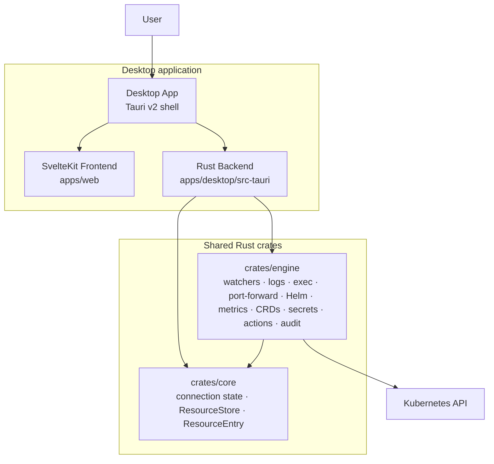
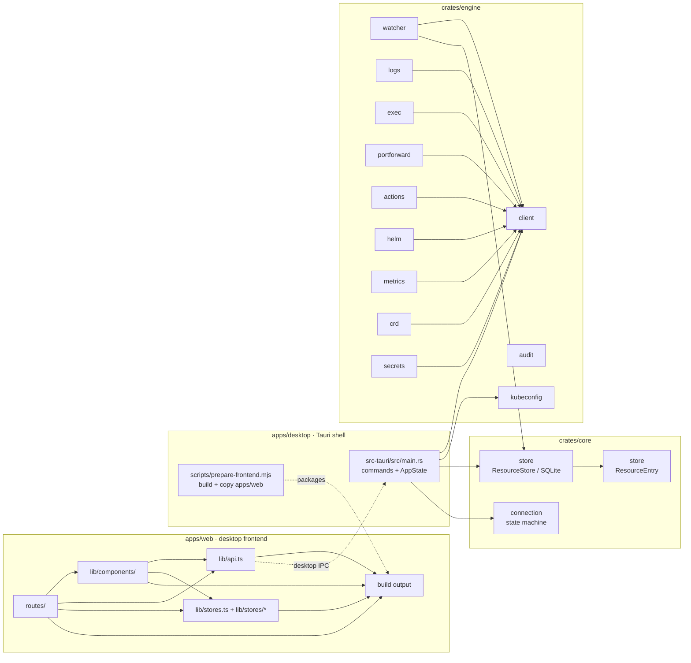
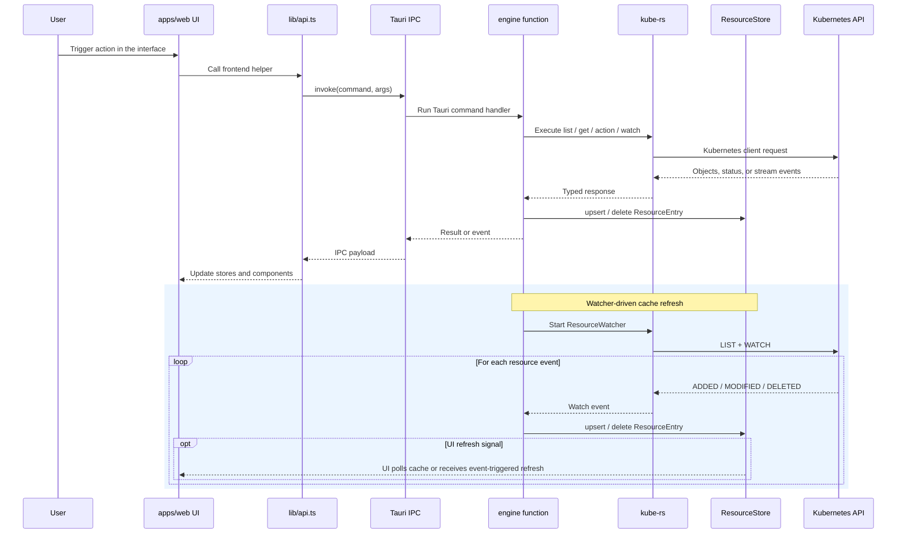
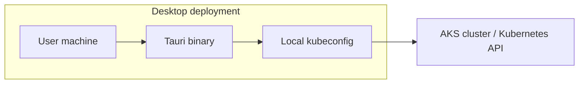

# Telescope Architecture Diagrams

These standalone diagrams summarize the current Telescope desktop architecture. They are grounded in the current code layout in `apps/web`, `apps/desktop`, `crates/engine`, and `crates/core`.

## 1. System Context Diagram

This diagram shows the primary user entry point: the Tauri desktop application, which packages the frontend and connects to the shared Rust engine to reach the Kubernetes API.

## 2. Component Diagram

This diagram breaks the repository into the main application and crate boundaries, then highlights the important modules inside each subsystem and the main dependency directions between them.

## 3. Data Flow Diagram

This diagram shows how a typical user action travels from the packaged frontend through the Tauri IPC path, and how watcher-driven synchronization keeps cached resource data current.

## 4. Desktop Deployment Architecture

This diagram shows the supported deployment shape today: a local desktop binary running on a user workstation with access to local kubeconfig.

