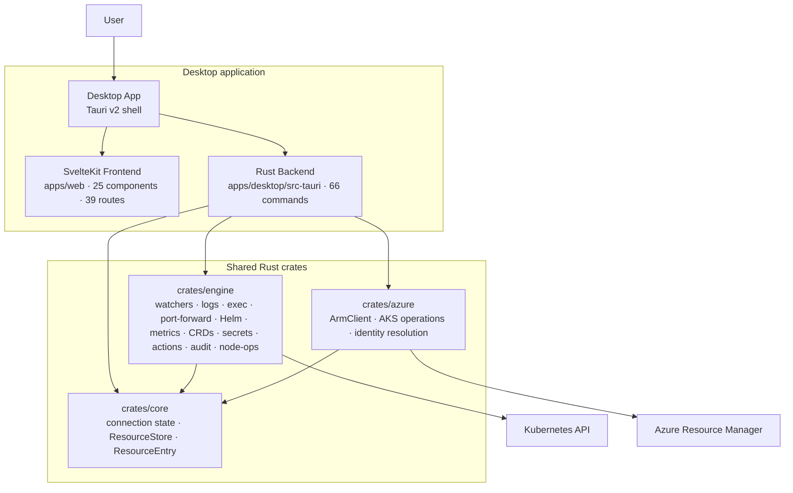
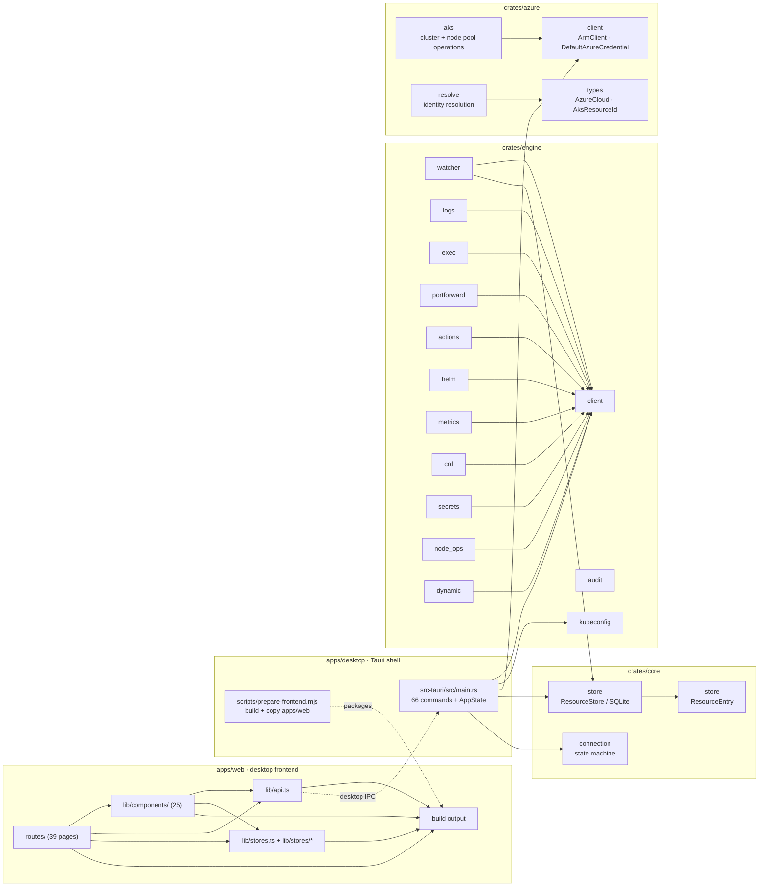
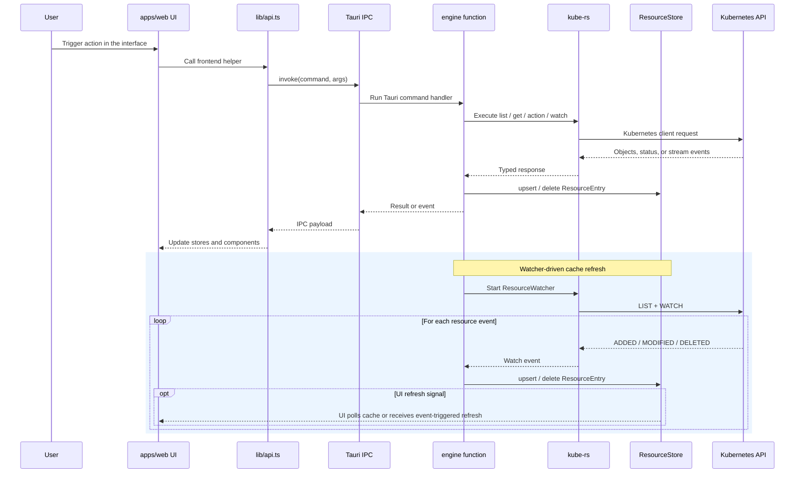
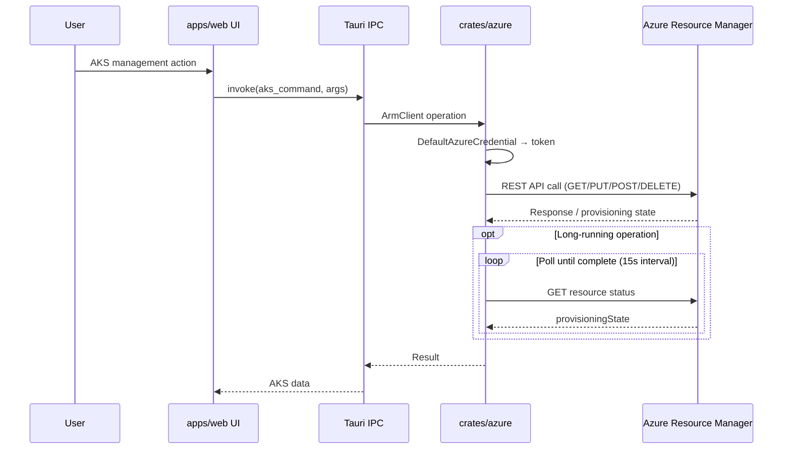
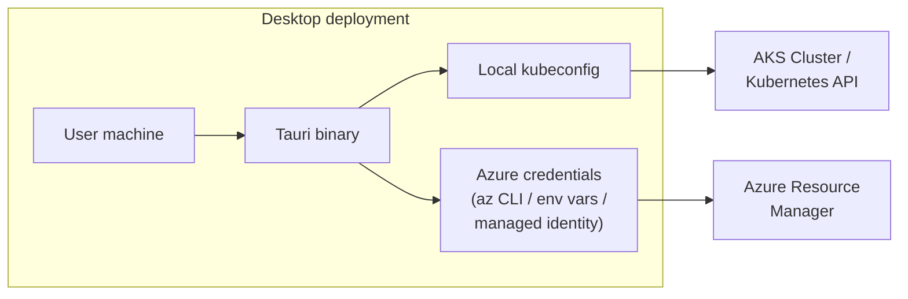

# Telescope Architecture Diagrams

These standalone diagrams summarize the current Telescope v1.0.0 desktop architecture. They are grounded in the current code layout in `apps/web`, `apps/desktop`, `crates/engine`, `crates/azure`, and `crates/core`.

## 1. System Context Diagram

The Tauri desktop application packages the frontend and connects to shared Rust crates for both Kubernetes API access and Azure ARM management.

## 2. Component Diagram

This diagram breaks the repository into application and crate boundaries, showing the modules and dependency directions.

## 3. Data Flow Diagram

Shows how a typical user action travels through the Tauri IPC path.

## 4. Azure ARM Flow

Shows how AKS management operations flow through the Azure ARM crate, separate from the Kubernetes API path.

## 5. Desktop Deployment Architecture

Desktop-only: a local Tauri binary with access to kubeconfig for Kubernetes and Azure credentials for ARM.

