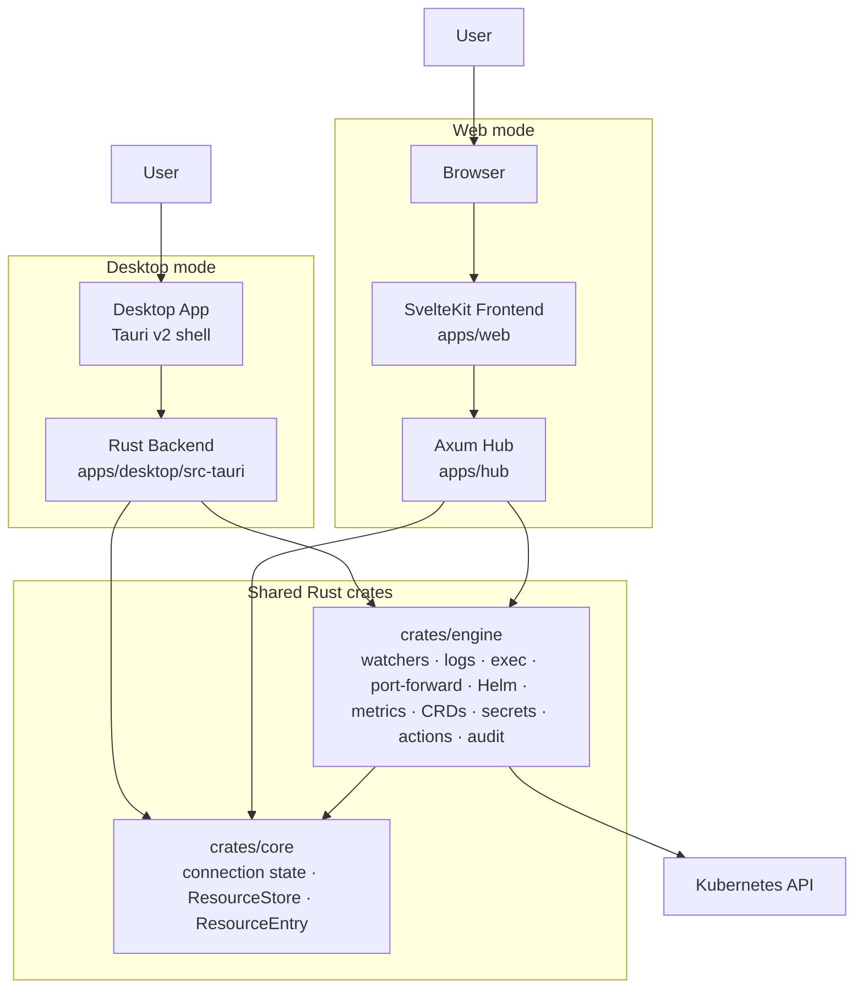
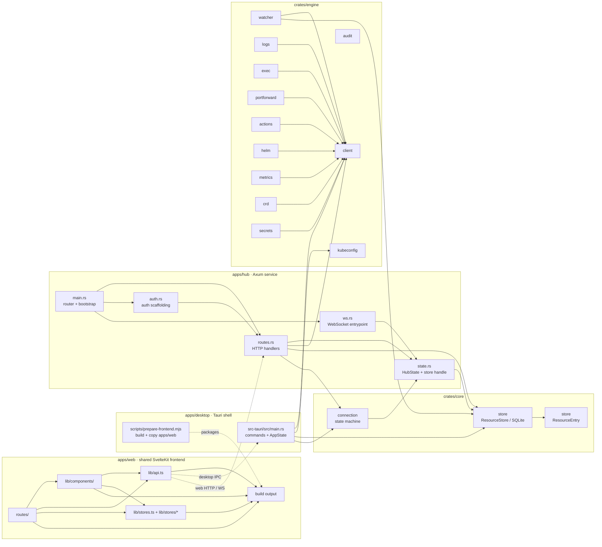
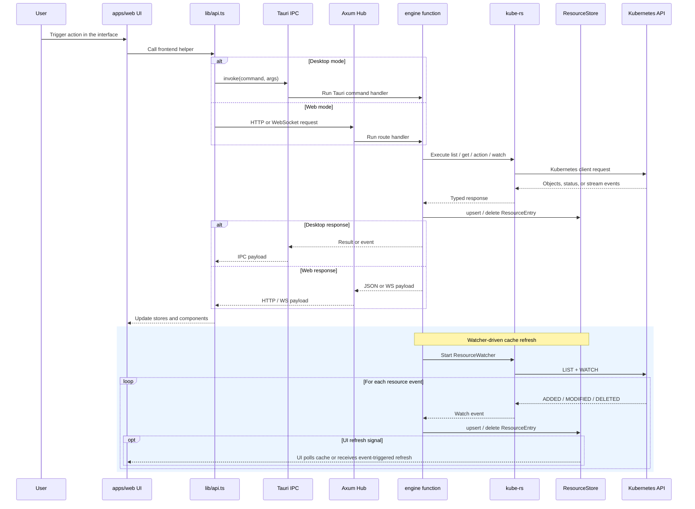
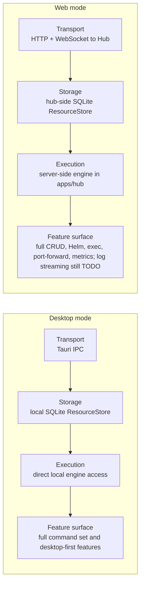
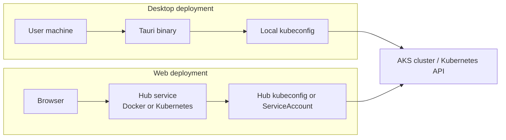

# Telescope Architecture Diagrams

These standalone diagrams summarize the current Telescope architecture across desktop and web modes. They are grounded in the current code layout in `apps/web`, `apps/desktop`, `apps/hub`, `crates/engine`, and `crates/core`.

## 1. System Context Diagram

This diagram shows the two primary user entry points: the Tauri desktop application and the browser-based web experience. Both runtime paths ultimately rely on the shared Rust engine and core crates to reach the Kubernetes API.

## 2. Component Diagram

This diagram breaks the repository into the main application and crate boundaries, then highlights the important modules inside each subsystem and the main dependency directions between them.

## 3. Data Flow Diagram

This diagram shows how a typical user action travels from the shared UI through either the desktop IPC path or the hub HTTP path, and how watcher-driven synchronization keeps cached resource data current.

## 4. Desktop vs Web Mode Comparison

This side-by-side comparison highlights where the two runtime modes differ in transport, storage location, engine placement, and currently available feature surface.

## 5. Deployment Architecture

This diagram shows the two deployment shapes supported today: a local desktop binary running on a user workstation and a browser-based deployment backed by the hub service running in Docker or Kubernetes.

